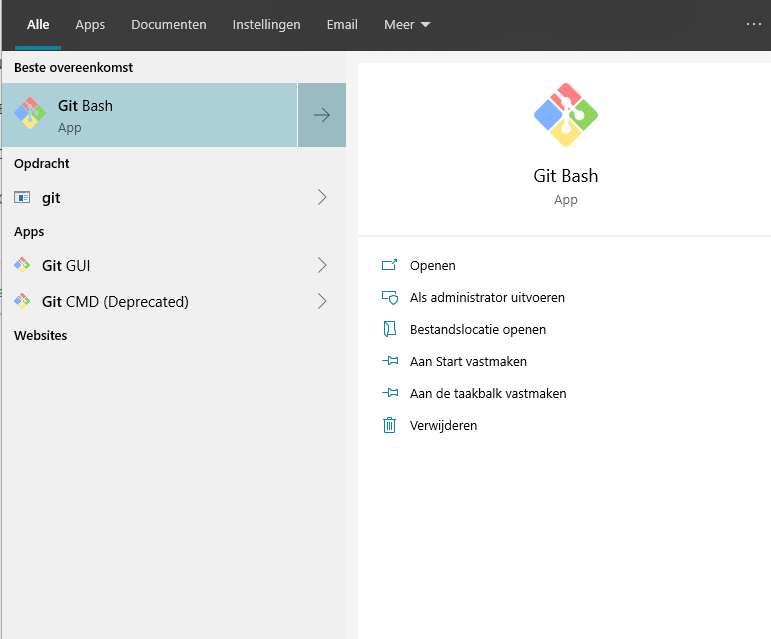
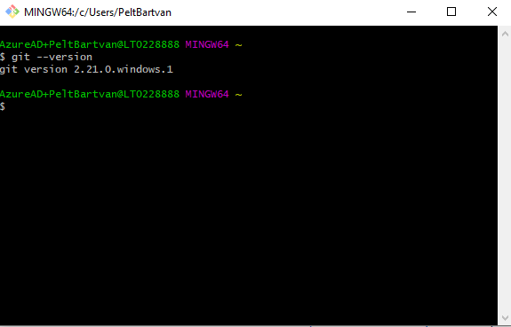
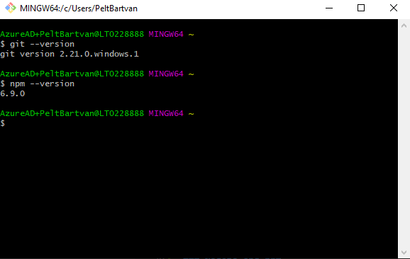

# [Angular course](#step-00)

Target: setup program environment on pc:
- [Requirements](#requirements)
- [Controle installatie](#controle-installatie)
    - [Controle gif](#git)
    - [Controle npm](#nodejs-and-npm)

## Requirements
- git for windows [https://gitforwindows.org/](https://gitforwindows.org/)
- nodejs and npm [https://nodejs.org/en](https://nodejs.org/en/)
- editor visual studio code [https://code.visualstudio.com/](https://code.visualstudio.com/)


## Controle installatie

### Git
Start git bash 



In git bash window
```bash
$ git --version
```


### Nodejs and npm
In the already opened git bash window
```bash
$ npm --version
```
