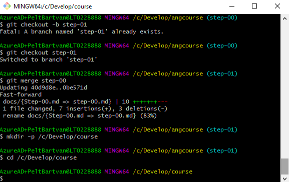
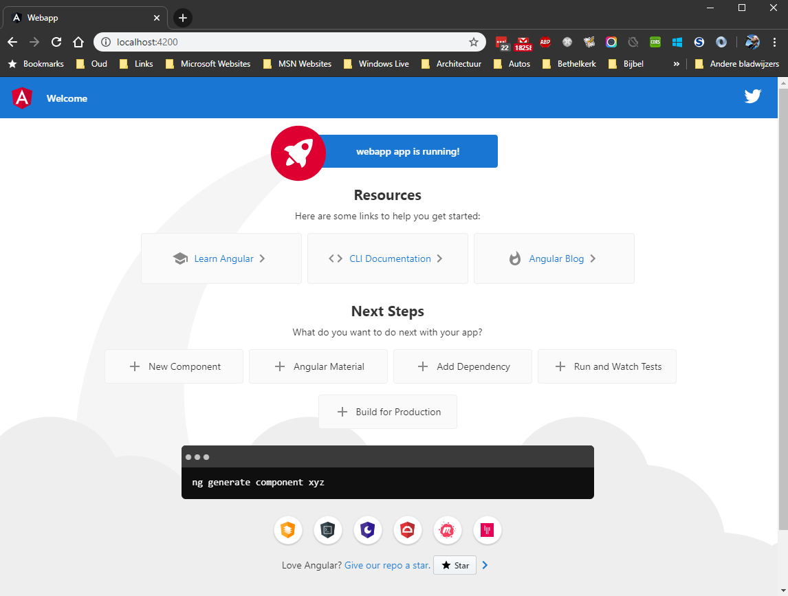

# Step 01

Target: setup project
- [create project directory](#create-project-dir)
- [install angular cli](install-angular)
- [start generated webapp](#start-generated-webapp)

## [Create project directory](#create-project-dir)
```bash
$ mkdir -p /c/Develop/course
$ cd /c/Develop/course
```


## [Install Angular CLI](#install-angular)
Angular provides a commandline interface to create angular components

```bash
$ npm install -g @angular/cli
```

Use the angular cli to create the application 'webapp'

```bash
$ npm new webapp --directory .
CREATE angular.json (3593 bytes)
CREATE package.json (1292 bytes)
CREATE README.md (1024 bytes)
CREATE tsconfig.json (543 bytes)
CREATE tslint.json (1953 bytes)
CREATE .editorconfig (246 bytes)
CREATE .gitignore (631 bytes)
CREATE browserslist (429 bytes)
CREATE karma.conf.js (1018 bytes)
CREATE tsconfig.app.json (270 bytes)
CREATE tsconfig.spec.json (270 bytes)
CREATE src/favicon.ico (948 bytes)
CREATE src/index.html (292 bytes)
CREATE src/main.ts (372 bytes)
CREATE src/polyfills.ts (2838 bytes)
CREATE src/styles.css (80 bytes)
CREATE src/test.ts (642 bytes)
CREATE src/assets/.gitkeep (0 bytes)
CREATE src/environments/environment.prod.ts (51 bytes)
CREATE src/environments/environment.ts (662 bytes)
CREATE src/app/app.module.ts (314 bytes)
CREATE src/app/app.component.html (25498 bytes)
CREATE src/app/app.component.spec.ts (981 bytes)
CREATE src/app/app.component.ts (210 bytes)
CREATE src/app/app.component.css (0 bytes)
CREATE e2e/protractor.conf.js (808 bytes)
CREATE e2e/tsconfig.json (214 bytes)
CREATE e2e/src/app.e2e-spec.ts (639 bytes)
CREATE e2e/src/app.po.ts (262 bytes)
npm WARN deprecated core-js@2.6.11: core-js@<3 is no longer maintained and not recommended for usage due to the number of issues. Please, upgrade your dependencies to the actual version of core-js@3.

> core-js@3.6.4 postinstall C:\Develop\course\node_modules\core-js
> node -e "try{require('./postinstall')}catch(e){}"


> core-js@2.6.11 postinstall C:\Develop\course\node_modules\karma\node_modules\core-js
> node -e "try{require('./postinstall')}catch(e){}"


> @angular/cli@8.3.25 postinstall C:\Develop\course\node_modules\@angular\cli
> node ./bin/postinstall/script.js

npm WARN karma-jasmine-html-reporter@1.5.2 requires a peer of jasmine-core@>=3.5 but none is installed. You must install peer dependencies yourself.
npm WARN optional SKIPPING OPTIONAL DEPENDENCY: fsevents@1.2.11 (node_modules\webpack-dev-server\node_modules\fsevents):
npm WARN notsup SKIPPING OPTIONAL DEPENDENCY: Unsupported platform for fsevents@1.2.11: wanted {"os":"darwin","arch":"any"} (current: {"os":"win32","arch":"x64"})
npm WARN optional SKIPPING OPTIONAL DEPENDENCY: fsevents@1.2.11 (node_modules\watchpack\node_modules\fsevents):
npm WARN notsup SKIPPING OPTIONAL DEPENDENCY: Unsupported platform for fsevents@1.2.11: wanted {"os":"darwin","arch":"any"} (current: {"os":"win32","arch":"x64"})
npm WARN optional SKIPPING OPTIONAL DEPENDENCY: fsevents@1.2.11 (node_modules\karma\node_modules\fsevents):
npm WARN notsup SKIPPING OPTIONAL DEPENDENCY: Unsupported platform for fsevents@1.2.11: wanted {"os":"darwin","arch":"any"} (current: {"os":"win32","arch":"x64"})
npm WARN optional SKIPPING OPTIONAL DEPENDENCY: fsevents@1.2.11 (node_modules\@angular\compiler-cli\node_modules\fsevents):
npm WARN notsup SKIPPING OPTIONAL DEPENDENCY: Unsupported platform for fsevents@1.2.11: wanted {"os":"darwin","arch":"any"} (current: {"os":"win32","arch":"x64"})
npm WARN optional SKIPPING OPTIONAL DEPENDENCY: fsevents@2.1.2 (node_modules\fsevents):
npm WARN notsup SKIPPING OPTIONAL DEPENDENCY: Unsupported platform for fsevents@2.1.2: wanted {"os":"darwin","arch":"any"} (current: {"os":"win32","arch":"x64"})

added 1177 packages from 1048 contributors and audited 19100 packages in 117.749s
found 0 vulnerabilities

warning: LF will be replaced by CRLF in .editorconfig.
The file will have its original line endings in your working directory
warning: LF will be replaced by CRLF in .gitignore.
The file will have its original line endings in your working directory
warning: LF will be replaced by CRLF in README.md.
The file will have its original line endings in your working directory
warning: LF will be replaced by CRLF in angular.json.
The file will have its original line endings in your working directory
warning: LF will be replaced by CRLF in browserslist.
The file will have its original line endings in your working directory
warning: LF will be replaced by CRLF in e2e/protractor.conf.js.
The file will have its original line endings in your working directory
warning: LF will be replaced by CRLF in e2e/src/app.e2e-spec.ts.
The file will have its original line endings in your working directory
warning: LF will be replaced by CRLF in e2e/src/app.po.ts.
The file will have its original line endings in your working directory
warning: LF will be replaced by CRLF in e2e/tsconfig.json.
The file will have its original line endings in your working directory
warning: LF will be replaced by CRLF in karma.conf.js.
The file will have its original line endings in your working directory
warning: LF will be replaced by CRLF in package-lock.json.
The file will have its original line endings in your working directory
warning: LF will be replaced by CRLF in package.json.
The file will have its original line endings in your working directory
warning: LF will be replaced by CRLF in src/app/app.component.html.
The file will have its original line endings in your working directory
warning: LF will be replaced by CRLF in src/app/app.component.spec.ts.
The file will have its original line endings in your working directory
warning: LF will be replaced by CRLF in src/app/app.component.ts.
The file will have its original line endings in your working directory
warning: LF will be replaced by CRLF in src/app/app.module.ts.
The file will have its original line endings in your working directory
warning: LF will be replaced by CRLF in src/environments/environment.prod.ts.
The file will have its original line endings in your working directory
warning: LF will be replaced by CRLF in src/environments/environment.ts.
The file will have its original line endings in your working directory
warning: LF will be replaced by CRLF in src/index.html.
The file will have its original line endings in your working directory
warning: LF will be replaced by CRLF in src/main.ts.
The file will have its original line endings in your working directory
warning: LF will be replaced by CRLF in src/polyfills.ts.
The file will have its original line endings in your working directory
warning: LF will be replaced by CRLF in src/styles.css.
The file will have its original line endings in your working directory
warning: LF will be replaced by CRLF in src/test.ts.
The file will have its original line endings in your working directory
warning: LF will be replaced by CRLF in tsconfig.app.json.
The file will have its original line endings in your working directory
warning: LF will be replaced by CRLF in tsconfig.json.
The file will have its original line endings in your working directory
warning: LF will be replaced by CRLF in tsconfig.spec.json.
The file will have its original line endings in your working directory
warning: LF will be replaced by CRLF in tslint.json.
The file will have its original line endings in your working directory
    Successfully initialized git.
```

## [Start generated webapp](start-generated-webapp)
Na opstarten van de applicatie
```bash
$ ng serve
i ｢wds｣: Project is running at http://localhost:4200/webpack-dev-server/
i ｢wds｣: webpack output is served from /
i ｢wds｣: 404s will fallback to //index.html

chunk {main} main.js, main.js.map (main) 47.8 kB [initial] [rendered]
chunk {polyfills} polyfills.js, polyfills.js.map (polyfills) 268 kB [initial] [rendered]
chunk {runtime} runtime.js, runtime.js.map (runtime) 6.15 kB [entry] [rendered]
chunk {styles} styles.js, styles.js.map (styles) 9.69 kB [initial] [rendered]
chunk {vendor} vendor.js, vendor.js.map (vendor) 3.81 MB [initial] [rendered]
Date: 2020-02-07T11:59:48.936Z - Hash: 6d231eaf3ad9ddc34e25 - Time: 7261ms
** Angular Live Development Server is listening on localhost:4200, open your browser on http://localhost:4200/ **
i ｢wdm｣: Compiled successfully.
```

Is deze te benaderen op [http://localhost:4200](http://localhost:4200)

