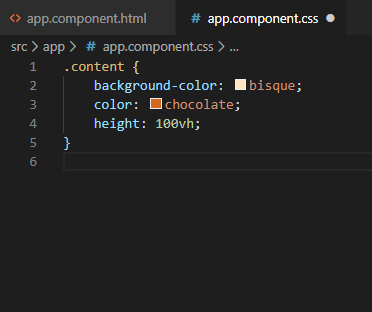

# Step 02
- [restart application server](#restart-application-server)
- [remove generated app](#remove-generated-app)
- [add some content](#add-some-content)
- [troubleshooting](#troubleshooting)

## [Restart application server](#restart-application-server)
If not already running, start the application server
```bash
$ ng serve
```
Open the browser at [http://localhost:4200/](http://localhost:4200/)

## [Remove generated app](#remove-generated-app)
Start the editor


Open the folder for the project


Remove content from the file src/app.component.html


Once removed, on the background the website is regenerated


## [Add some content](#add-some-content) 
Add content to the file src/app.component.html

```html
<div class="content">
    <p>
        This is my first web page
    </p>
</div>
```
Only after ^S the file is written to disk and compiled and served.

The following information appears


Styling can be added by adding css text to src/app.component.css. For example
background and color attributes:
```css
.content {
    background-color: bisque;
    color: chocolate;
    height: 100vh;
}
```



## [Troubleshooting](#troubleshooting)
If page doesnot appear as expected use the developertools to inspect the page.

 