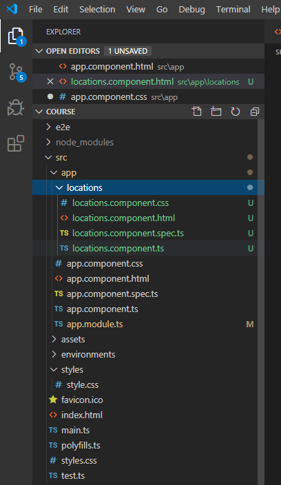
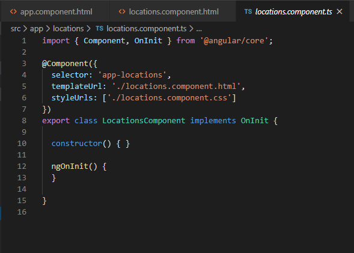
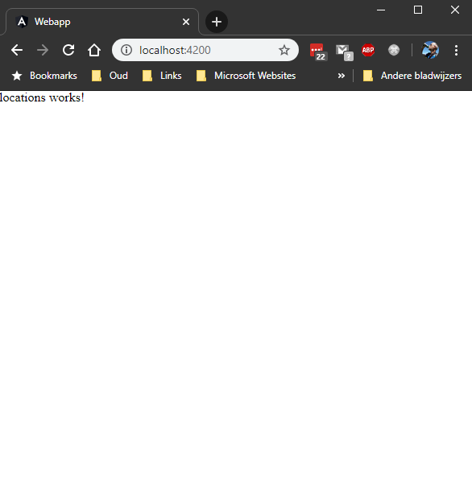
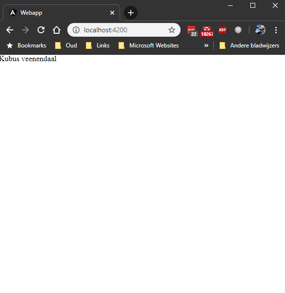
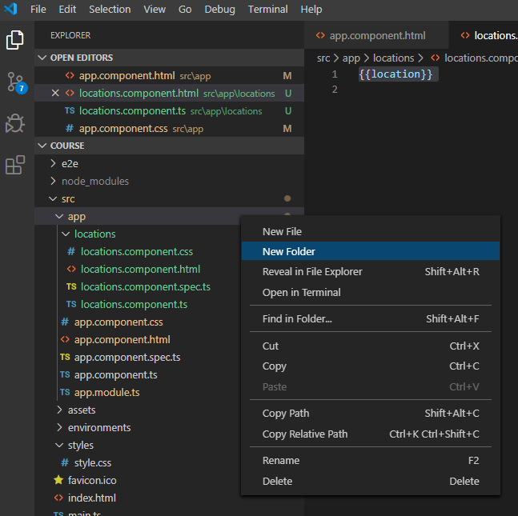
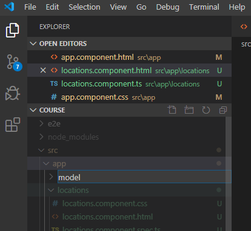
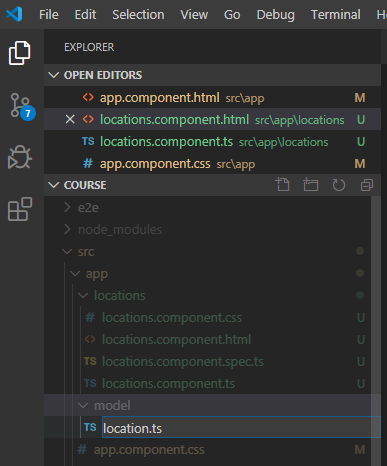

# [Step 03](#step-03)

- [Cleanup](#cleanup)
- [Generate locations component](#generate-loc-comp)
- [Add location](#add-location)
    - [Change locations component typescript](#change-location)
    - [Change locations html](#change-location-html) 
    - [Refactor location](#refactor-location)
        - [Create location.ts](#create-location)
        - [Refactor src/app/locations/locations.component.ts](#refactor-locations)
        - [Refactor src/app/locations/locations.component.html](#refactor-locations-html)

## [Cleanup ](#cleanup)
Remove styling from src/app/app.component.css

## [Generate locations component](#generate-loc-comp)
```bash
$ ng generate component locations
CREATE src/app/locations/locations.component.html (24 bytes)
CREATE src/app/locations/locations.component.spec.ts (649 bytes)
CREATE src/app/locations/locations.component.ts (281 bytes)
CREATE src/app/locations/locations.component.css (0 bytes)
UPDATE src/app/app.module.ts (408 bytes)
```

It shows up in the src/app directory



In src/app/locations/location.component.ts it show the definition of an angular
component with its own 'selector' **app-locations**



To use the app-locations selector add it to src/app/app.component.html. 

```html
<div class="content">
    <app-locations></app-locations>
</div>
```

After saving then changes and starting the server with

```bash
$ ng serve
```

one can now see then new component



## [Add location](#add-location)

### [Change locations component typescript](#change-location)
To really use the locaions component, first add a location.
Change src/app/locations/locations.component.ts so it looks like:

```typescript
import { Component, OnInit } from '@angular/core';

@Component({
  selector: 'app-locations',
  templateUrl: './locations.component.html',
  styleUrls: ['./locations.component.css']
})
export class LocationsComponent implements OnInit {

  location = 'Kubus veenendaal';
  
  constructor() { }

  ngOnInit() {
  }

}
```

### [Change locations html](#change-location-html) 
Inject the information from the typescript component into the html file.
Change src/app/locations/locations.component.html and add a placeholder so it looks like:

```html
{{location}}
```

Now the location appears in the web browser



### [Refactor location](#refactor-location)
Normally a location would have more properties. In order to make that possible, create a new directory in src/app called model.

#### [Create location.ts](#create-location)
Go to src/app use right mouse and select **New Folder**



Type the name of the new directory **model**



In the created directory src/app/model create a file named location.ts.
Go to src/app/model use right mouse and select **New File**



Add the following content to src/app/model/location.ts:

```typescript
export interface Location {
    id: number;
    street: string;
    housenumber: number;
    postalcode: string;
    city: string;
}
```

#### [Refactor src/app/locations/locations.component.ts](#refactor-locations)
Change the content of location.component.ts to:

```typescript
import { Component, OnInit } from '@angular/core';
import { Location } from '../model/location';

@Component({
  selector: 'app-locations',
  templateUrl: './locations.component.html',
  styleUrls: ['./locations.component.css']
})
export class LocationsComponent implements OnInit {

  location: Location = {
    id: 1,
    street: 'Kubus veenendaal',
    housenumber: 2,
    postalcode: '3904 AB',
    city: 'Veenendaal'
  };

  constructor() { }

  ngOnInit() {
  }

}
```

#### [Refactor src/app/locations/locations.component.html](#refactor-locations-html)
To use the new location with multiple properties change the content of location.component.html to: 

```html
<div>
    <div style="display: table-row;">
        <div style="display: table-cell;">id:</div>
        <div style="display: table-cell;">{{location.id}}</div>
    </div>
    <div style="display: table-row;">
        <div style="display: table-cell;">street:</div>
        <div style="display: table-cell;">{{location.street}}</div>
    </div>
    <div style="display: table-row;">
        <div style="display: table-cell;">housenumber:</div>
        <div style="display: table-cell;">{{location.housenumber}}</div>
    </div>
    <div style="display: table-row;">
        <div style="display: table-cell;">postalcode:</div>
        <div style="display: table-cell;">{{location.postalcode}}</div>
    </div>
    <div style="display: table-row;">
        <div style="display: table-cell;">city:</div>
        <div style="display: table-cell;">{{location.city}}</div>
    </div>
</div>
```
